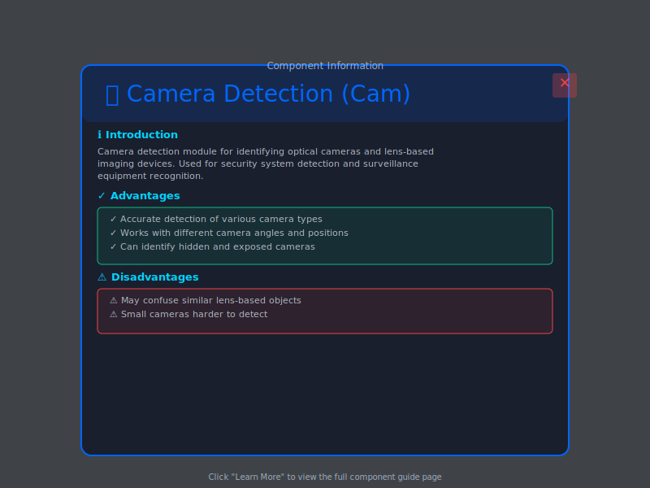
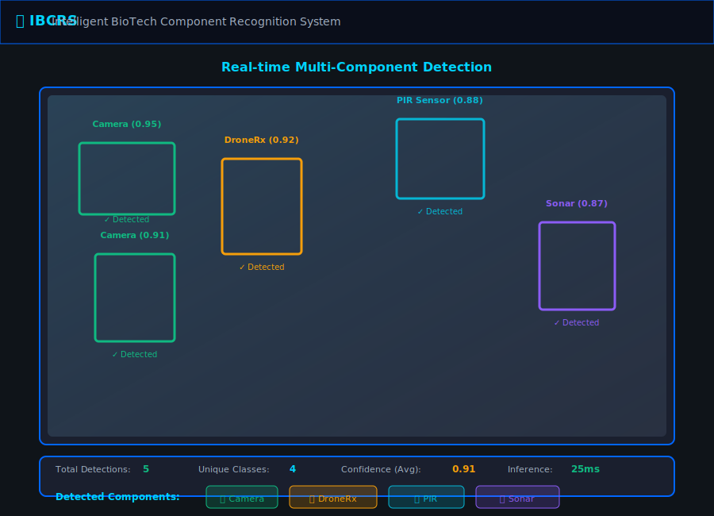
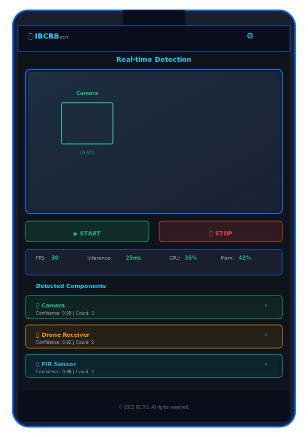

# IBCRS - Intelligent BioTech Component Recognition System

A professional web application for real-time object detection using YOLOv8 deep learning model. This system is designed for intelligent recognition and identification of biosensors, equipment components, and laboratory instruments used in biotechnology research.

## 📋 Features

- **Real-time Detection**: Live object detection from webcam feed
- **High Performance**: YOLOv8 state-of-the-art accuracy and speed
- **Performance Monitoring**: Real-time FPS, inference time, and system metrics
- **System Resource Tracking**: CPU and memory usage monitoring
- **Professional UI**: Modern, responsive web interface
- **RESTful API**: Easy integration with other applications
- **Mobile Responsive**: Works on desktop and mobile devices

## 🏗️ Project Structure

```
website/
├── backend/
│   ├── app.py                 # Flask backend with detection logic
│   └── requirements.txt        # Python dependencies
├── frontend/
│   ├── index.html             # Main HTML file
│   ├── css/
│   │   └── style.css          # Professional styling
│   ├── js/
│   │   └── main.js            # Frontend logic and API integration
│   └── assets/                # Images and other assets
└── README.md                  # This file
```

## 🚀 Quick Start

### Prerequisites

- **Python 3.8+**
- **Webcam**
- **YOLOv8 Model** (e.g., `yolo8bestfile.pt`)

### Installation

1. **Clone or navigate to the website directory:**
   ```bash
   cd d:\IBCRS\website
   ```

2. **Create a Python virtual environment:**
   ```bash
   python -m venv venv
   ```

3. **Activate the virtual environment:**
   - **Windows:**
     ```bash
     .\venv\Scripts\activate
     ```
   - **macOS/Linux:**
     ```bash
     source venv/bin/activate
     ```

4. **Install backend dependencies:**
   ```bash
   cd backend
   pip install -r requirements.txt
   ```

### Configuration

Edit `backend/app.py` to configure:

```python
MODEL_PATH = r"D:\IBCRS\yolo8bestfile.pt"  # Path to your YOLOv8 model
CONFIDENCE_THRESHOLD = 0.4                  # Detection confidence (0-1)
IMG_SIZE = 640                              # Model input size
FRAME_WIDTH = 1280                          # Webcam resolution
FRAME_HEIGHT = 720                          # Webcam resolution
```

## 📸 Screenshots & Interface

The IBCRS system features a modern, intuitive interface for real-time component detection. Below are mockups of the key interface screens:

### Main Detection Interface

The primary dashboard showing live video feed with real-time object detection, performance metrics (FPS, inference time, CPU/memory usage), and detected components with learning resources.

### Component Information Modal

Interactive modal popup displaying detailed information about detected components, including advantages and disadvantages for each detected item.

### Component Guide Page

Dedicated information page for each component showing comprehensive documentation, advantages/disadvantages, and tutorial video references.

### Performance Dashboard

Real-time performance monitoring dashboard displaying FPS, inference time, CPU/memory usage, and detailed detection statistics for each component class.

### Multi-Component Detection

Demonstration of multiple components detected simultaneously with real-time bounding boxes, confidence scores, and detection counts on the video feed.

### Mobile Responsive View

Responsive design for mobile and tablet devices, with optimized layout for smaller screens while maintaining full functionality.

### System Overview Dashboard

Comprehensive overview of all 7 recognized components (4 sensors + 3 lab equipment), system statistics, and unified detection history.

## 🎯 Detectable Components

The IBCRS system is trained to recognize **7 different components**:

### Biosensors & IoT Devices
1. **📷 Camera (Cam)** - Visual image capture and monitoring
2. **🛰️ Drone Receiver (DroneRx)** - Drone RF signal reception
3. **💡 PIR Sensor** - Motion and thermal sensing
4. **📡 Sonar Sensor** - Ultrasonic distance measurement

### Laboratory Equipment
5. **🧪 Colorimeter** - Light absorption and color measurement
6. **🔧 Magnetic Stirrer** - Sample stirring and mixing
7. **💧 pH Meter** - pH (acidity) measurement

Each component has a dedicated information page accessible from the main interface with detailed descriptions, use cases, and technical specifications.

## 🚀 Running the Application

### Start the Backend Server

```bash
python backend/app.py
```

The server will start on `http://localhost:5000`

You should see:
```
Loading YOLOv8 model...
Model loaded successfully!
Starting IBCRS Live Detection Server...
Access the application at: http://localhost:5000
```

### Access the Web Interface

1. Open your web browser
2. Navigate to `http://localhost:5000`
3. Click **"Start Detection"** to begin live object detection
4. View real-time statistics on the right panel

## 🎮 Usage Guide

### Dashboard Features

**Video Feed**
- Live video stream with real-time object detection
- Bounding boxes around detected objects
- Class labels with confidence scores

**Inference Time Display**
- Shows processing time for each frame
- Helps monitor system performance

**Control Buttons**
- **Start**: Initiate live detection from webcam
- **Stop**: Stop the detection stream
- **Snapshot**: Capture current frame (saved to downloads)

**Performance Metrics**
- Inference Time (ms)
- FPS (Frames Per Second)
- CPU Usage (%)
- Memory Usage (%)

**Detection Summary**
- Total detections in current frame
- Breakdown by detected class

**System Information**
- Model version (YOLOv8)
- Confidence threshold
- Video resolution

## 🔌 API Endpoints

### Start Detection
```
POST /api/start
```
Starts the detection process.

### Stop Detection
```
POST /api/stop
```
Stops the detection process.

### Get Statistics
```
GET /api/stats
```
Returns current detection statistics:
```json
{
  "total_detections": 5,
  "inference_time": 15.23,
  "fps": 30,
  "cpu_usage": 45.2,
  "memory_usage": 62.1,
  "is_running": true,
  "detected_classes": {
    "person": 2,
    "car": 1,
    "plant": 2
  }
}
```

### Health Check
```
GET /api/health
```
Returns server health status:
```json
{
  "status": "healthy",
  "model_loaded": true,
  "detection_running": true
}
```

## 🛠️ Technology Stack

### Backend
- **Flask** - Web framework
- **OpenCV** - Computer vision
- **YOLOv8** - Object detection model
- **PyTorch** - Deep learning framework
- **psutil** - System monitoring

### Frontend
- **HTML5** - Structure
- **CSS3** - Modern styling with gradients and animations
- **JavaScript** - Interactivity and API integration
- **Font Awesome** - Icons

## ⚙️ Advanced Configuration

### Adjust Confidence Threshold
Edit `backend/app.py`:
```python
CONFIDENCE_THRESHOLD = 0.4  # Range: 0.0 - 1.0
```
(0 = detect everything, 1 = only high-confidence detections)

### Change Webcam Resolution
Edit `backend/app.py`:
```python
FRAME_WIDTH = 1280   # Increase for higher quality
FRAME_HEIGHT = 720
```

### Use Different YOLOv8 Model
Edit `backend/app.py`:
```python
MODEL_PATH = r"path\to\your\model.pt"
```

Available YOLOv8 variants:
- `yolov8n.pt` - Nano (fastest, lowest accuracy)
- `yolov8s.pt` - Small
- `yolov8m.pt` - Medium
- `yolov8l.pt` - Large
- `yolov8x.pt` - Extra Large (slowest, highest accuracy)

## 🐛 Troubleshooting

### Server Won't Start
- Check Python version: `python --version`
- Verify port 5000 is available: `netstat -an | findstr :5000`
- Install missing dependencies: `pip install -r requirements.txt`

### Model Not Loading
- Verify model file exists at specified path
- Check model file isn't corrupted
- Ensure CUDA compatible GPU (if using GPU)

### Webcam Not Detected
- Check other applications aren't using the webcam
- Grant browser permission to access camera
- Try a different camera index in code

### High Latency/Low FPS
- Reduce image size: `IMG_SIZE = 416`
- Use faster model: `yolov8n.pt`
- Lower confidence threshold
- Close other applications

## 📊 Performance Benchmarks

Approximate performance on mid-range systems:

| Model | Inference Time | FPS |
|-------|-----------------|-----|
| YOLOv8n | 10-15ms | 60-90 |
| YOLOv8s | 15-25ms | 40-60 |
| YOLOv8m | 25-40ms | 25-40 |
| YOLOv8l | 40-60ms | 15-25 |

## 🔒 Security Considerations

- Keep model file path secure
- Use HTTPS in production environments
- Validate all API inputs
- Implement authentication for remote access
- Monitor resource usage

## 📝 Performance Tips

1. **GPU Acceleration**
   - Use GPU if available for 5-10x speed improvement
   - Install PyTorch with CUDA support

2. **Model Selection**
   - Use smaller models for real-time applications
   - Use larger models for accuracy-critical tasks

3. **Frame Processing**
   - Lower resolution = faster processing
   - Skip frames for smooth video without latency

## 🚀 Future Enhancements

- [ ] Multiple webcam support
- [ ] Video file input
- [ ] Recording and playback
- [ ] Analytics dashboard
- [ ] WebSocket for real-time updates
- [ ] Docker containerization
- [ ] Cloud deployment
- [ ] Custom model training interface

## 💬 Support & Documentation

- **YOLOv8 Docs**: https://docs.ultralytics.com/
- **Flask Docs**: https://flask.palletsprojects.com/
- **OpenCV Docs**: https://docs.opencv.org/

## 📄 License

This project is provided as-is for educational and agricultural purposes.

## 👨‍💻 Author

IBCRS Development Team

---

**Last Updated**: February 2026
**Version**: 1.0.0
